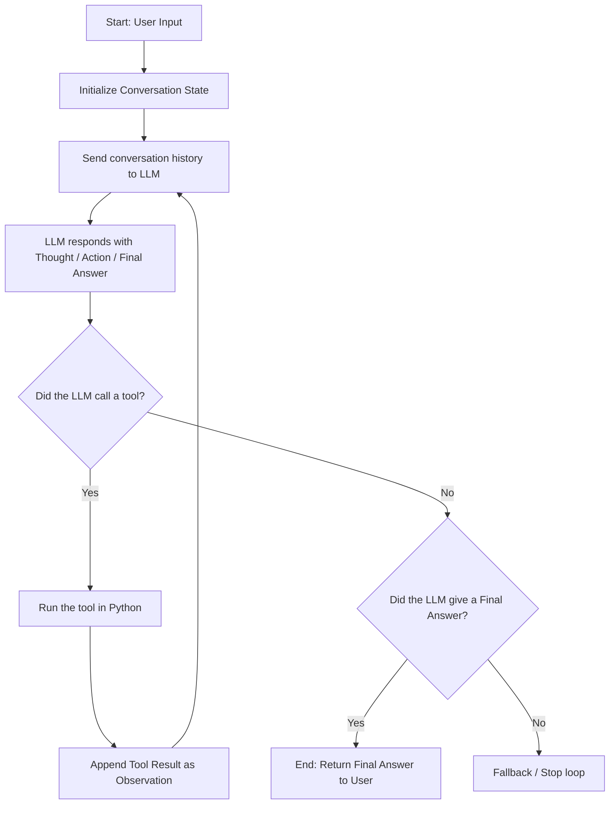

# P01 — ReAct Agent from Scratch

Welcome to **Project 1** of the **Agentic Engineering Bootcamp v2.3**. 

This is a foundational, hands-on learning project designed to build a complete **ReAct (Reasoning + Acting)** research agent from first principles.

---

## 🚀 Getting Started (For Learners & Developers)

If you are a developer looking to build your own first-principles understanding of agentic engineering, **do not just copy the completed code on `main`**! 

Instead, checkout the **[`starter-kit`](https://github.com/edgeq/react-agent/tree/starter-kit)** branch to embark on your own hands-on learning experience:

```bash
git checkout starter-kit
```

### 🎓 The Pedagogical Philosophy: AI as a Tutor
The purpose of this project and its accompanying AI coding assistant tools (Claude, Antigravity, Cursor, etc.) is **NOT for the AI agent to write the code for you**. 

Instead, the AI agent is configured to act as a **Tutor and Architecture Guide**:
* **You write the code**: You struggle through thinking about data structures, API contracts, execution loops, and error handling.
* **The AI guides & reviews**: The AI explains design patterns, reviews your code, points out edge cases, and prompts you to write each incremental piece.

### 🧰 Built-in Repository Skills
This repository includes specialized repository skills in [`.agents/skills/`](.agents/skills/) and [`.claude/skills/`](.claude/skills/) to assist your learning journey:
* **`research-latest`**: Forces the agent to research and verify that you are building with up-to-date APIs (e.g., modern OpenAI Responses API, Pydantic v2 conventions, ddgs scraping patterns) before writing code.
* **`update-progress`**: Serves as a mechanism for following and maintaining the planned architecture of the project in `CLAUDE.md` and `AGENTS.md` as files are built.

---

## 🎯 Project Goal

The primary goal of this project is to build a fully capable, tool-calling research agent using **raw API calls only—without relying on any high-level agent frameworks** (like LangChain, LangGraph, or CrewAI). 

By building the execution flow, state management, and tool integration by hand, we master the underlying mechanics of modern AI agents:
* Managing conversation history as memory.
* Structuring LLM thoughts, actions, and observations.
* Handling tool execution and state synchronization.
* Building evaluation suites to measure accuracy and efficiency.

---

## 🔄 The ReAct Loop Architecture

A ReAct agent combines **Reasoning** (the "Thought") and **Acting** (the "Action"). The agent follows an iterative cycle to solve a user's prompt:



### The Step-by-Step Cycle:
1. **Thought**: The LLM reasons about the user's request and determines what information it is missing (e.g., *"I need to know the weather in Seattle, so I should call the search tool"*).
2. **Action (Tool Call)**: The LLM chooses a tool and provides the exact parameters to call it.
3. **Observation**: Our code intercepts the tool request, executes the corresponding Python function, and returns the result (the "Observation") to the LLM.
4. **Final Answer**: Once the LLM has gathered enough observations, it synthesizes them and presents the final answer to the user.

---

## 🛠️ Tech Stack & Tooling

* **Python 3.13** — Pinned and managed via `.python-version`.
* **`uv`** — High-performance Rust-based Python package manager and workspace tool.
* **OpenAI Responses API** — Utilizing `client.responses.create()`, the modern standard for interacting with frontier models (like `gpt-5.4-mini`).
* **Pydantic v2** — Used for robust runtime data validation and state modeling.
* **Additional Libraries** *(to be installed as you build)*:
  * `ddgs` (DuckDuckGo Search) — For privacy-focused web searches (Step 5).
  * `httpx` — Async-compatible HTTP client for webpage scraping (Step 6).
  * `beautifulsoup4` + `markdownify` — HTML parser and Markdown converter (Step 6).
  * `pytest` — Test suite runner (Step 7).

---

## 📁 Codebase Structure (Starter State)

```
p01-react-agent/
├── main.py                        # TODO: CLI entry point stub
├── pyproject.toml                 # Project metadata and base dependencies
├── uv.lock                        # Lockfile generated by uv
├── .vscode/
│   └── settings.json              # VS Code path resolutions for Pylance
├── .agents/
│   └── skills/                    # Repository skills for agentic guidance
│       ├── research-latest/
│       └── update-progress/
├── .claude/
│   └── skills/                    # Repository skills for Claude/Cursor
│       ├── research-latest/
│       └── update-progress/
├── src/
│   └── agent/
│       ├── __init__.py
│       ├── config.py              # TODO: Pydantic Settings env loader stub
│       ├── loop.py                # (not yet created - Step 3)
│       ├── llm/
│       │   ├── __init__.py
│       │   └── client.py          # TODO: OpenAI Responses API client stub
│       ├── tools/
│       │   ├── __init__.py        # Exports registry & tools (not yet created)
│       │   ├── registry.py        # Dynamic registry & schema parser (not yet created - Step 4)
│       │   ├── web_search.py      # DuckDuckGo search tool (not yet created - Step 5)
│       │   └── read_url.py        # Webpage markdown reader tool (not yet created - Step 6)
│       └── models/
│           ├── __init__.py
│           └── messages.py        # Pydantic models for Message & ConversationState (not yet created - Step 1)
├── evals/
│   ├── __init__.py
│   ├── dataset.json               # 20-question evaluation dataset (not yet created - Step 7)
│   ├── metrics.py                 # LLM-as-a-judge accuracy & hallucination metrics (not yet created - Step 7)
│   ├── report.md                  # Generated markdown evaluation report (not yet created - Step 7)
│   └── run_evals.py               # Evaluation runner CLI (not yet created - Step 7)
└── tests/
    ├── conftest.py                # Test suite configuration (not yet created - Step 7)
    └── test_loop.py               # Offline mock unit tests (not yet created - Step 7)
```

---

## 🚀 How to Get Started

1. **Environment Setup**:
   Create a `.env` file in the project root:
   ```env
   OPENAI_API_KEY="your-api-key"
   MODEL="gpt-5.4-mini"
   ```

2. **Install Base Dependencies**:
   Install the project in editable mode:
   ```bash
   uv pip install -e .
   ```

3. **Begin Your Guided Journey**:
   Open your preferred AI Coding Assistant (Claude, Antigravity, Cursor, etc.) and prompt it:
   > *"Let me know what Step 1 is in AGENTS.md, ask me 'Is this the latest and best way to do this?', and prompt me to write the code incrementally."*
