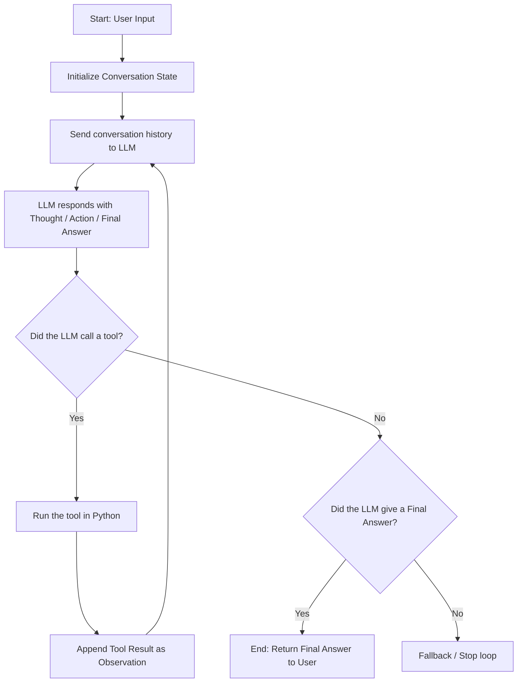

# P01 — ReAct Agent from Scratch

Welcome to **Project 1** of the **Agentic Engineering Bootcamp v2.3**. 

This is a foundational, hands-on learning project designed to build a complete **ReAct (Reasoning + Acting)** research agent from first principles.

---

## 🎯 Project Goal

The primary goal of this project is to build a fully capable, tool-calling research agent using **raw API calls only—without relying on any high-level agent frameworks** (like LangChain, LangGraph, or CrewAI). 

By building the execution flow, state management, and tool integration by hand, we master the underlying mechanics of modern AI agents:
* Managing conversation history as memory.
* Structuring LLM thoughts, actions, and observations.
* Handling tool execution and state synchronization.
* Building evaluation suites to measure accuracy and efficiency.

---

## 🔄 The ReAct Loop Architecture

A ReAct agent combines **Reasoning** (the "Thought") and **Acting** (the "Action"). The agent follows an iterative cycle to solve a user's prompt:



### The Step-by-Step Cycle:
1. **Thought**: The LLM reasons about the user's request and determines what information it is missing (e.g., *"I need to know the weather in Seattle, so I should call the search tool"*).
2. **Action (Tool Call)**: The LLM chooses a tool and provides the exact parameters to call it.
3. **Observation**: Our code intercepts the tool request, executes the corresponding Python function, and returns the result (the "Observation") to the LLM.
4. **Final Answer**: Once the LLM has gathered enough observations, it synthesizes them and presents the final answer to the user.

---

## 🛠️ Tech Stack & Tooling

* **Python 3.13** — Pinned and managed via `.python-version`.
* **`uv`** — High-performance Rust-based Python package manager and workspace tool.
* **OpenAI Responses API** — Utilizing `client.responses.create()`, the modern standard for interacting with frontier models (like `gpt-5.4-mini`).
* **Pydantic v2** — Used for robust runtime data validation and state modeling.
* **Libraries**:
  * `ddgs` (DuckDuckGo Search) — For privacy-focused web searches.
  * `httpx` — Async-compatible HTTP client for webpage scraping.
  * `beautifulsoup4` + `markdownify` — HTML parser and Markdown converter for read URL observations.
  * `pytest` — Test suite runner.

---

## 📁 Codebase Structure

```
p01-react-agent/
├── main.py                        # Thin CLI entry point
├── pyproject.toml                 # Project metadata and dependencies
├── uv.lock                        # Lockfile generated by uv
├── .vscode/
│   └── settings.json              # VS Code path resolutions for Pylance
├── src/
│   └── agent/
│       ├── __init__.py
│       ├── config.py              # Loads settings from .env using Pydantic Settings
│       ├── loop.py                # Core ReAct loop implementation (completed)
│       ├── llm/
│       │   ├── __init__.py
│       │   └── client.py          # OpenAI Responses API wrapper
│       ├── tools/
│       │   ├── __init__.py        # Exports tools with package-level relative imports
│       │   ├── registry.py        # Dynamic tool registry & JSON schema parser (completed)
│       │   ├── web_search.py      # DuckDuckGo search tool wrapper (completed)
│       │   └── read_url.py        # BeautifulSoup & Markdown URL reader tool (completed)
│       └── models/
│           ├── __init__.py
│           └── messages.py        # Pydantic models for Message and ConversationState
├── evals/
│   ├── __init__.py
│   ├── dataset.json               # 20-question evaluation dataset
│   ├── metrics.py                 # LLM-as-a-judge accuracy, hallucination, and efficiency metrics
│   ├── report.md                  # Generated evaluation report
│   └── run_evals.py               # Evaluation CLI runner
└── tests/
    ├── conftest.py
    └── test_loop.py               # pytests with mocked DDGS context manager
```

---

## 🚀 How to Run the Project

1. **Environment Setup**:
   Create a `.env` file in the project root:
   ```env
   OPENAI_API_KEY="your-api-key"
   MODEL="gpt-5.4-mini"
   ```

2. **Install Dependencies**:
   Install the project and its dependencies in editable mode:
   ```bash
   uv pip install -e .
   ```

3. **Run the Agent CLI**:
   ```bash
   uv run python main.py "Your prompt here"
   ```

4. **Run the Unit Tests**:
   Execute the fast, offline test suite:
   ```bash
   uv run pytest
   ```

5. **Run the Evaluation Suite**:
   Run the 20-question accuracy and hallucination evaluation harness:
   ```bash
   uv run python evals/run_evals.py
   ```
